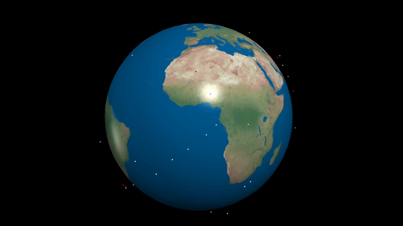

# Space Debris Dynamics Simulation

## Overview
This repository hosts a dynamic simulation of space debris to study the onset of Kessler Syndrome. The simulation incorporates a probabilistic collision model and a network analysis approach to explore critical transitions within a modeled debris field in Earth orbit. The project uses various computational methods to simulate orbital mechanics, collision probabilities, and debris evolution over time, employing statistical analysis and visualizations to compare the outcomes under various scenarios.



## Authors
- Xiaoxuan Zhang (here the contributor: HarvestStars)
- Maarten Stork
- Zoë Azra Blei
- Ilias-Panagiotis Sofianos

## Acknowledgments
Parts of the visualization code were inspired by work from Derk Niessink. His repository [OrbitSmash](https://github.com/DerkNiessink/OrbitSmash) provided valuable insights into 3D orbital trajectory rendering. We greatly appreciate his contributions to the field.

## Project Structure

- sim/: Contains the main simulation scripts.
    - main.py: Demonstrates a 3D orbital model. To use the physical orbital model, modify the entry function from run_network_sim to run_sim. If you're interested in viewing the 3D behavior of the orbital network without considering gravity, velocity, and other physical models, you can run this script directly without any modifications.
    - model.py: Provides functions for the physical orbital model.
    - model_network.py: Contains network simulation functions used by main.py.
    - network/: Focuses on statistical measurements of the model.
        - network.py: Entry point for network simulations. It records all data using the project's file system (sim/file_system) into the root directory's results folder.
        visualization.py: Plots 3D trends and phase transition diagrams related to the network model.
    - Final_Plots.ipynb: Aggregates results from the network simulation process found in the results folder, presenting a unified view of the project's simulation outcomes.


## Dependencies
This project requires the following Python libraries:
- **numpy**: For numerical operations.
- **matplotlib**: For creating visualizations.
- **pandas**: For data manipulation and analysis.
- **networkx**: For creating and manipulating complex network structures.
- **numba**: For accelerating numerical algorithms.
- **vpython**: For real-time 3D animations.
- **scipy**: For scientific and technical computing.

Additionally, standard Python libraries such as `sys`, `os`, `random`, `time`, and `itertools` are used for various helper functions.

## Installation

### Clone the Repository
```bash
git clone https://github.com/zoeazra/ComplexSystemsProject.git
cd space-debris-simulation
```

### Set Up a Virtual Environment
```bash
python -m venv venv
source venv/bin/activate  # On Unix or MacOS
venv\Scripts\activate  # On Windows
```

### Install Dependencies
```bash
pip install -r requirements.txt
```

## 3D Visulization Present

Navigate to the simulation directory and execute the main simulation script. Specify a group number to target specific data subsets. Optionally, add `view` to enable visual animations displayed in a web browser.

```bash
cd sim
python main.py [Group number] [view]
```

### Example Commands
- To run the simulation for group 0 without visualization:
  ```bash
  python main.py 0
  ```

- To run the simulation with visualization for group 0:run_sim
  ```bash
  python main.py 0 view
  ```

## Network Statistic Present
- Navigate to the sim/network/ directory.
- Run network.py to start the network simulation. This will record data into the results folder using the project's file system.
- Use visualization.py in the sim/network/ directory to generate 3D trend and phase transition plots related to the network model.
- Open Final_Plots.ipynb in the sim/ directory to view a comprehensive presentation of the simulation results.

## License
This project is licensed under the MIT License - see the LICENSE.md file for details.


